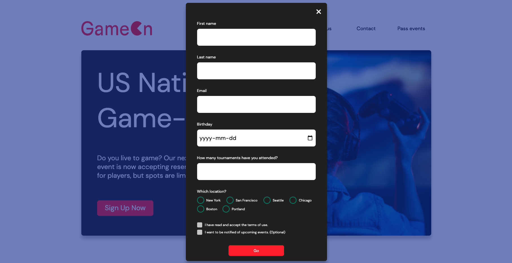

# Project 4 OpenClassrooms - Create a landing page with JavaScript

## Logo

## Technical constraints

### 1. Close modal

- Add functionality to button (X).

### 2. Implement form inputs

- Link labels to the inputs in the HTML using the "for" and "id" attributes in the existing code.
- Use pure JavaScript (not jQuery) to complete the form: The form must be valid when the user clicks on "Submit"

### 3. Data must be entered correctly

- First name field has a minimum of 2 characters / is not empty.
- Last name field has a minimum of 2 characters / is not empty.
- The email address is valid.
- For the number of tournaments, the value is numeric.
- A radio button can be selected.
- The terms and conditions box can be checked, the other box is optional / can be unchecked.
- Keep the form data (do not delete the form) when it does not pass validation.

### 4. Add validation or error messages

- Error messages should appear under the corresponding input field.
- Examples:
  - "Please enter 2 or more characters for the name field."
  - "You must choose an option."
  - "You must verify that you agree to the terms and conditions."
  - "You must enter your date of birth."

### 5. Add confirmation when successfully submitted

- After a successful validation, provide a confirmation message of the successful submission to the user
- Example: "Thank you! Your reservation has been received!"

### 6. Manual testing

- View and test the user interface in the latest versions of Chrome and Firefox, as well as mobile and desktop versions.
- Fix existing display errors.
- Test all button and form input functionality (test for correct and incorrect values).

## Mockup

